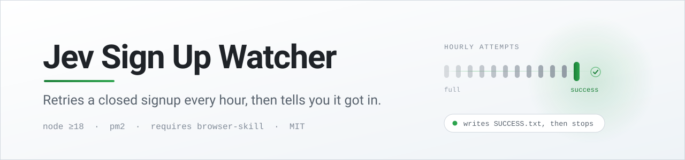

<div align="center">

<picture>
  <source media="(prefers-color-scheme: dark)" srcset="assets/banner-dark.svg">
  <source media="(prefers-color-scheme: light)" srcset="assets/banner-light.svg">
  
</picture>

<br>

[](https://nodejs.org)
[](#requirements)
[](https://pm2.keymetrics.io/)
[](#requirements)
[](#license)

</div>

---

TypeSafe AI closes signups when it hits capacity — the console answers with
`?error=signups_disabled` and a "Whoops, we're full" page. Capacity frees up without
announcement, so the only way in is to keep checking.

This watcher does that for you. Once an hour it drives a **background** window of your
own signed-in Chrome, walks the "Continue with Google" flow, and reads where it lands.
If it's still full, it waits and tries again. If it gets in, it writes a marker file,
raises a desktop notification, and stops.

One dependency, browser-skill (the `bsk` CLI and its Chrome extension). No npm packages,
no API keys, no stored credentials — it reuses the Google session
already in your browser.

## Requirements

| | |
|---|---|
| **OS** | Windows (uses PowerShell for the notification) |
| **Runtime** | Node.js 18 or newer |
| **Process manager** | [PM2](https://pm2.keymetrics.io/) |
| **Browser control** | The `bsk` CLI and its Chrome extension, connected — `bsk browsers` should list your browser |
| **Account** | Chrome already signed in to the Google account you want to register with |

## Quick start

```sh
git clone https://github.com/deskengineai/typesafe-watcher.git
cd typesafe-watcher

cp .env.example .env       # then set GOOGLE_EMAIL

npm run pm2                # start under PM2 and persist the process list
pm2 logs typesafe-watcher  # follow it
```

To survive a reboot, install [pm2-windows-startup](https://www.npmjs.com/package/pm2-windows-startup) once:

```sh
npm i -g pm2-windows-startup
pm2-startup install
```

Prefer to run it in the foreground? `npm start`.

## Configuration

Set in `.env` (never committed — it's in `.gitignore`).

| Variable | Required | Default | Description |
|---|---|---|---|
| `GOOGLE_EMAIL` | yes | — | The Google account to sign up with. Must already be signed in to Chrome. |
| `BSK_PATH` | no | `%USERPROFILE%\.local\bin\bsk.exe` | Path to the `bsk` CLI, if it isn't in the default location. |

### How often it checks

Hourly by default. The interval is a single constant at the top of `watcher.js`, so set it to
whatever suits the window you are waiting on:

```js
const INTERVAL_MS = 60 * 60 * 1000;   // hourly, the default
const INTERVAL_MS = 5 * 60 * 1000;    // every 5 minutes
```

Five minutes is 288 checks a day against one public signup form, using one account — still
patient. Going far below that earns you rate limiting rather than a seat.

## How a check works

Each attempt opens its own `bsk` session and always closes it, even when the attempt throws.

1. Navigate to `console.typesafe.ai/login`.
   If the URL no longer contains `/login`, a previous run already got in → **success**.
2. Find **Continue with Google** by its visible text and click it.
   Element references are resolved fresh from `bsk observe` every time, never hard-coded.
3. Poll every 3 seconds, up to 20 times, handling whatever appears:
   - **Google's account chooser** → click the entry matching `GOOGLE_EMAIL`
   - **A consent screen** → click Continue or Allow
   - **Back on the console** → classify the result

### Outcomes

| Result | Detected by | What happens |
|---|---|---|
| `full` | `signups_disabled` in the URL, or "we're full" in the page text | Logged. Retries in 60 minutes. |
| `success` | A `console.typesafe.ai` page that is **not** `/login` or `/auth/*`, seen twice in a row | Writes `SUCCESS.txt`, shows a desktop popup, stops checking. |
| `unknown` | Ran out of polls without a clear answer | Logged with the final URL. Retries in 60 minutes. |
| `error` | The attempt threw | Logged with the message. Retries in 60 minutes. |

> **Why twice in a row?** `/auth/callback` is an intermediate hop that redirects back to
> `/login?error=...` when the service is full. A single non-login page is therefore not
> proof of success — two consecutive ones are.

## Operating it

```sh
pm2 logs typesafe-watcher     # follow output
pm2 restart typesafe-watcher  # apply a config change
pm2 stop typesafe-watcher     # pause checking
pm2 delete typesafe-watcher   # remove it entirely
```

The watcher is **self-terminating**. Once `SUCCESS.txt` exists it idles instead of
checking — including across restarts — so it will not keep hammering a signup you
already completed. Delete `SUCCESS.txt` to resume.

## Troubleshooting

| Symptom | Cause | Fix |
|---|---|---|
| `GOOGLE_EMAIL is not set` | No `.env`, or the variable is blank | `cp .env.example .env` and fill it in |
| `"Continue with Google" button not found` | The login page changed, or it hadn't finished loading | Check the page manually; the button is matched on visible text |
| Every attempt returns `error` | `bsk` isn't on the expected path, or the extension isn't connected | Run `bsk browsers` — it should list your Chrome. Set `BSK_PATH` if the binary lives elsewhere |
| Result is always `unknown` | Google asked for something unhandled, such as 2FA or a password re-prompt | Complete the sign-in once by hand, then let the watcher resume |
| Nothing happens after success | Working as intended — `SUCCESS.txt` exists | Delete `SUCCESS.txt` to start checking again |

## Project layout

```
watcher.js            The whole watcher: env loading, bsk driving, the retry loop
ecosystem.config.js   PM2 process definition
.env.example          Template for .env
PROMPT.md             The prompt that generated this project, for rebuilding it
```

## Notes

- Runs at **one attempt per hour** against a public signup form, using your own account.
  It is a patient poller, not a bulk registration tool.
- Your email only ever reaches the browser and your local logs, and is redacted in the
  account-chooser log line.
- `.env` and `SUCCESS.txt` are git-ignored, so neither your address nor your signup state
  is ever committed.

## License

MIT
